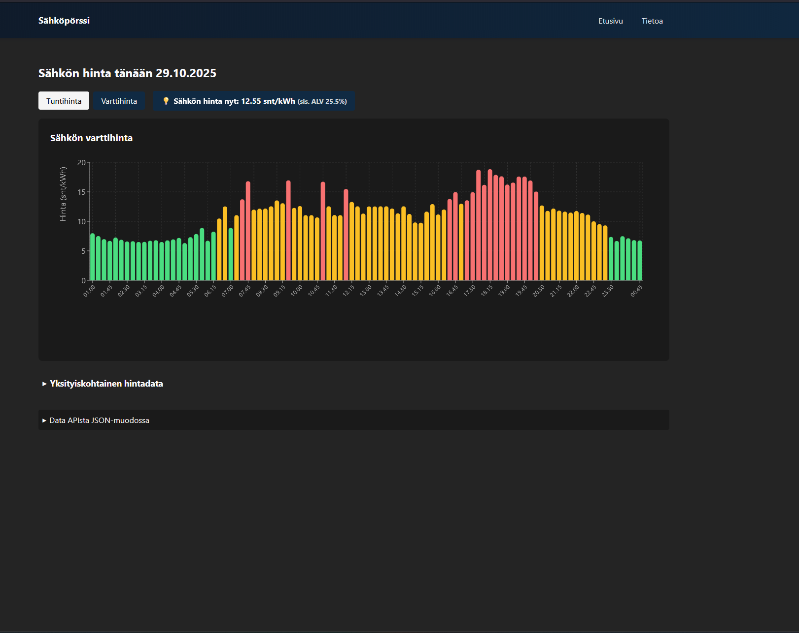

# Energy Prices - Finland

A React + TypeScript application for displaying real-time energy prices in Finland using the ENTSOE Transparency Platform API.
Provides a clean barchart, a table view and the raw data from API formatted xml -> JSON.

## Setup

1. Clone the repository
2. Copy `.env.example` to `.env`:
   ```bash
   cp .env.example .env
   ```
3. Add your ENTSOE security token to `.env`:
   - Get your token from: https://transparency.entsoe.eu/
   - Add the token to `VITE_ENTSOE_SECURITY_TOKEN` in your `.env` file
4. Install dependencies:
   ```bash
   npm install
   ```
5. Start the development server:
   ```bash
   npm run dev
   ```

## Environment Variables

- `VITE_ENTSOE_SECURITY_TOKEN`: Your ENTSOE API security token (required)

**Important Security Note**: In frontend applications, environment variables are bundled into the JavaScript and are visible in the browser. For production applications handling sensitive data, consider implementing a backend proxy that keeps the API token server-side.

---
